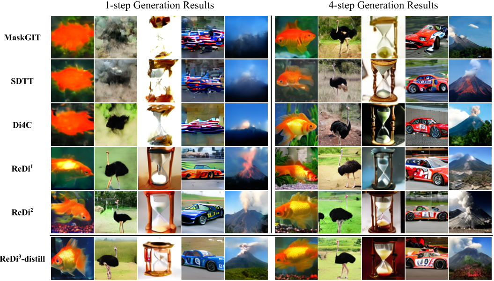

# ReDi: Rectified Discrete Flow

By [Jaehoon Yoo](https://sites.google.com/view/jaehoon-yoo/), [Wonjung Kim](https://github.com/wjhjkim), [Seunghoon Hong](https://maga33.github.io/)

This repository contains the official implementation of the paper:
[ReDi: Rectified Discrete Flow (arXiv, 2025)](https://arxiv.org/abs/2507.15897)

We introduce *ReDi*, a novel iterative mothod that reduces factorization error by rectifying the coupling between source and target distribution.

In this repo, we integrate [Halton-MaskGIT](https://github.com/valeoai/Halton-MaskGIT/tree/v1.0) and [DUO](https://github.com/s-sahoo/duo) as the structural foundation for our implementation, which involves both image and text models to demonstrate the ReDi method.

<p align="center">
    <div style="background-color:#f0f0f0; display:inline-block;">
        
    </div>
</p>

## Project Structure
      ├ image/                                        <- MaskGIT based ReDi-image code
      |    ├── Metrics/                               <- Evaluation tool
      |    |      ├── inception_metrics.py                  
      |    |      └── sample_and_eval.py
      |    |    
      |    ├── Network/                             
      |    |      ├── Taming/                         <- VQGAN architecture   
      |    |      ├── reweight_mlp.py                 <- Embedding architecture  
      |    |      └── transformer.py                  <- Transformer architecture  
      |    |
      |    ├── Trainer/                               <- Main class for training
      |    |      ├── trainer.py                      <- Abstract trainer     
      |    |      └── vit.py                          <- Trainer of MaskGIT
      |    |
      |    ├── Scripts/                               <- Shell scripts for training/evaluation.
      |    |      ├── create_rectified_dataset.sh     <- Rectify the model 
      |    |      ├── finetune_model.sh               <- Finetune the model (from origin MaskGIT)     
      |    |      ├── test_model.sh                   <- Test the model
      |    |      └── train_model.sh                  <- Train the model
      |    |
      |    ├── compute_tc.py                          <- Compute the TC
      |    ├── download_models.py                     <- Download the pretrained models
      |    ├── LICENSE.txt                            <- MIT license
      |    ├── requirements.yaml                      <- Help to install env 
      |    ├── README.md                              
      |    └── main.py                                <- Main
      |
      ├ text/                                         <- Duo based ReDi-text code
      |    ├── config/                                <- Config files for datasets/denoising networks/noise schedules/LR schedules.
      |    |      └── config.yaml                     <- Main config file
      |    |
      |    ├── integral/
      |    |    
      |    ├── models/                                <- Denoising network architectures. Supports [DiT](https://arxiv.org/abs/2212.09748) and AR transformer.
      |    |      ├── dit.py                          <- DiT structure
      |    |      ├── ema.py                          <- EMA model
      |    |      └── unit_test_attention.py          <- Attention module
      |    |
      |    ├── scripts/                               <- Shell scripts for training/evaluation.
      |    |      ├── distil_*                        <- Distillate the model    
      |    |      ├── eval_*                          <- Evaluate the model     
      |    |      ├── gen_ppl_*                       <- Measure the generation perplexity     
      |    |      ├── gen_ppl_tc_*                    <- Measure the generation perplexity and total correlation score
      |    |      ├── rectifi_*                       <- Rectify the model
      |    |      ├── train_*                         <- Train the model 
      |    |      └── zero_shot_*                     
      |    |
      |    ├── algo.py                                <- Main model structures: Algorithms such as DUO, MDLM, AR, SEDD, D3PM, ReDi.
      |    ├── dataloader.py                          <- Dataloader and tokenizer module
      |    ├── LICENSE                                <- Apache License 2.0
      |    ├── main.py                                <- Main
      |    ├── metrics.py                             <- Metrics module
      |    ├── README.md                              
      |    ├── requirements.yaml                      <- Help to install env 
      |    ├── trainer_base.py                        <- Boiler plate trainer using pytorch lightning.
      |    └── utils.py                               <- LR scheduler, logging, `fsspec` handling.

## Usage
To get started, you can follow the process in "Usage" part of each [image](image/README.md) and [text](text/README.md) folder's README.

## Experiment score
### Image

| Step | Model | FID(↓) | IS(↑) | Prec.(↑) | Rec.(↑) | Den.(↑) | Cov.(↑) |
|------|-------|--------|-------|----------|---------|---------|---------|
| 1 | MaskGIT | 95.16 | 12 | 0.26 | 0.12 | 0.17 | 0.35 |
|  | SDTT | 90.40 | 14 | 0.31 | 0.13 | 0.21 | 0.34 |
|  | Di4C | 90.32 | 13 | 0.26 | 0.24 | 0.17 | 0.33 |
|  | ReDi<sup>1</sup> | 37.43 | 49 | 0.63 | 0.51 | 0.78 | 0.86 |
|  | ReDi<sup>2</sup> | 21.80 | 90 | 0.74 | **0.52** | 1.05 | 0.93 |
|  | ReDi<sup>3</sup>-distill | **11.68** | **182** | **0.83** | 0.44 | **1.25** | **0.96** |
| 4 | MaskGIT | 10.90 | 184 | 0.83 | 0.46 | 1.18 | 0.96 |
|  | SDTT | 8.97 | 205 | **0.88** | 0.41 | 1.43 | 0.97 |
|  | Di4C | **6.20** | 216 | 0.87 | **0.52** | 1.33 | **0.98** |
|  | ReDi<sup>1</sup> | 7.58 | 228 | 0.87 | 0.46 | 1.33 | **0.98** |
|  | ReDi<sup>2</sup> | 7.86 | **240** | 0.87 | 0.44 | 1.31 | 0.97 |
| 8 | MaskGIT | 6.51 | 227 | 0.89 | 0.48 | 1.38 | 0.98 |

### Text

<p align="center">
  
</p>

## License
The ReDi-image(Halton-MaskGIT-based ReDi) is licensed under the MIT License, and the ReDi-text(DUO-based ReDi) is licensed under the Apache License 2.0. From this, this project is licensed under the Apache License 2.0.

## Acknowledgments
The pretrained VQGAN ImageNet is from the [Halton-MaskGIT](https://github.com/valeoai/Halton-MaskGIT/tree/v1.0) and [LlamaGen](https://github.com/FoundationVision/LlamaGen?tab=readme-ov-file) official repository.

## Citation
Cite our paper using:
```bibtex
@misc{yoo2025redirectifieddiscreteflow,
      title={ReDi: Rectified Discrete Flow}, 
      author={Jaehoon Yoo and Wonjung Kim and Seunghoon Hong},
      year={2025},
      eprint={2507.15897},
      archivePrefix={arXiv},
      primaryClass={cs.LG},
      url={https://arxiv.org/abs/2507.15897}, 
}
```
